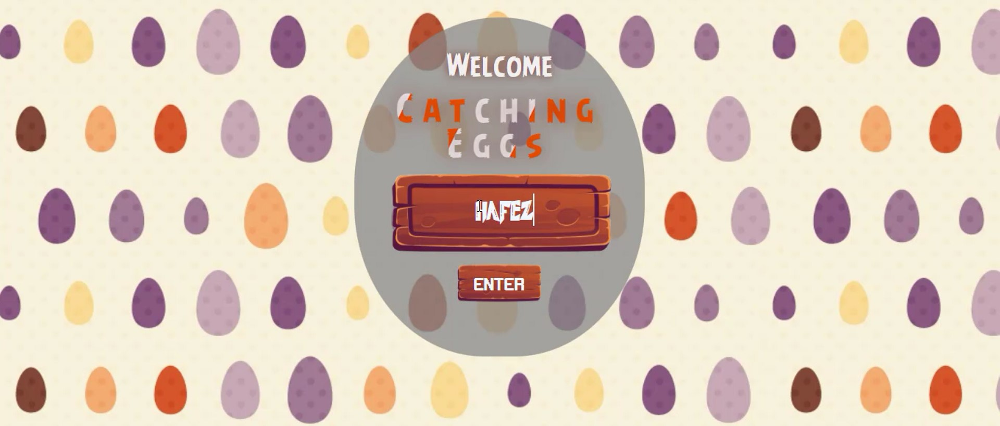
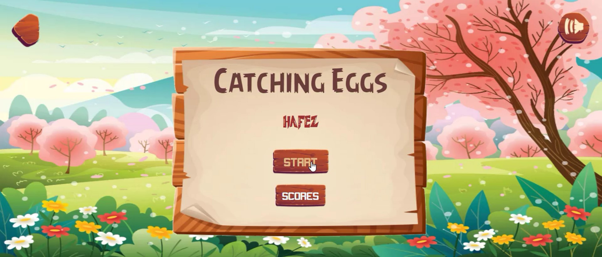
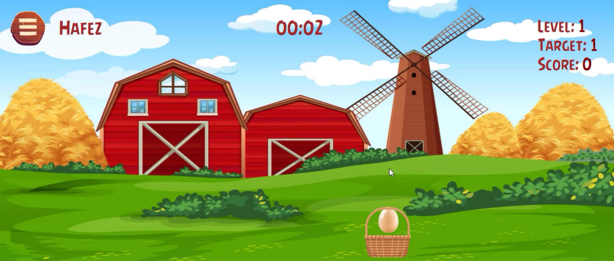
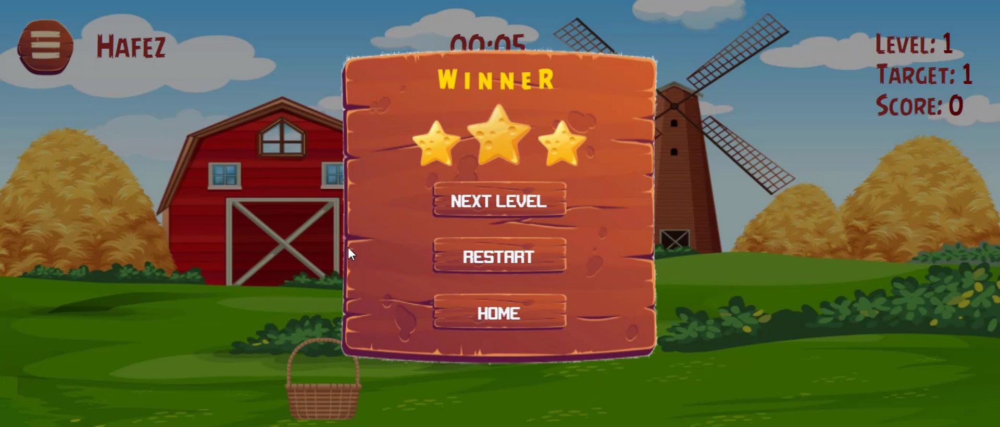
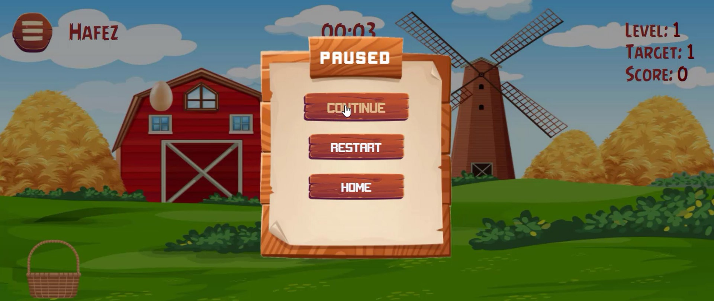

# Catching Eggs Game with JavaScript

## Content

1. [About the game](#about-the-game)
2. [Run the game](#run-the-game)
3. [Project Structure](#project-structure)
    - [JavaScript Structure](#javascript-structure)
    - [Files description and contents](#files-description-and-contents)
4. [Screenshots](#screenshots)

## About the game

The goal of the game is catching the falling eggs using the basket, the player should get the target score to move to the next level.

## Run the game

The app needs to run in live server (in VSCode for example)

## Project Structure

- index.html
- assets/
  - css/
  - fonts/
  - images/
  - scripts/
  - sounds/

### JavaScript Structure

- Objects/
  - Basket.js
  - Egg.js
- Windows/
  - PauseWindow.js
  - ScoreWindow.js
- Game.js
- GameController.js
- ScreensController.js
- SoundController.js
- Defaults.js
- APIUtils.js
- PopupModal.js
- Utils.js
- Elements.js

### Files description and contents

| file                 | description                                                                          |
| -------------------- | ------------------------------------------------------------------------------------ |
| Game.js              | starter point of the app (initialize game controllers and objects)                   |
| GameController.js    | controlls whole the game (e.g., creates eggs and manage game time and score)         |
| ScreensController.js | the only class that manages the screens (e.g., move from main menu to game screen)   |
| SoundController.js   | the only class that manages the sound (effects and background music)                 |
| Objects/             | contains Egg and basket classes                                                      |
| Windows/             | contains the puase and score window with full functionaliy of showing the hidding    |
| PopupModal.js        | contains class need to be inherited to implement a popup window                      |
| Utils.js             | contains general functions used eveywhere in the project                             |
| Defaults.js          | contains the default values of the game (e.g., game time and difficulty difficulity) |
| APIUtils.js          | contains functions responsible for sending requests                                  |
| Elements.js          | the only file that selects UI Elements                                               |

## Screenshots

